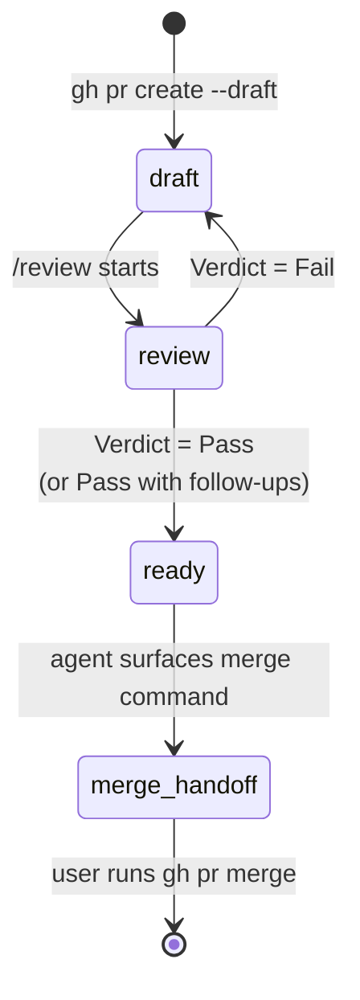

A PR moves through four phases. soloscrum's contract draws the line between transitions the agent runs autonomously and transitions that require user confirmation.

- **Reversible transitions are autonomous.** The agent runs them, then reports.
- **Irreversible transitions are user-gated.** The agent surfaces the exact command and stops.
- **The verdict is the decision point.** Once `/review` reaches Pass, the post-verdict actions run end-to-end. The agent does not pause to re-confirm each reversible step.

Pausing on a reversible step after a Pass verdict — for example, asking "may I run `gh pr ready`?" — violates this contract.

## Phases



`/develop` creates the PR directly as **draft**. soloscrum never creates a PR as ready and demotes it; agents never demote a ready PR back to draft.

| Phase | GitHub state | Owner | Purpose | Exit |
|---|---|---|---|---|
| `draft` | open, draft | dev | Implementation lands; local quality gate runs | `/review` is launched |
| `review` | open, draft | review | DoD + AC + CodeRabbit + multi-agent + per-finding decisions | Verdict reached |
| `ready` | open, ready | review | Verdict was Pass; tracker subtask is `done`; CI is green | merge command surfaced |
| `merge-handoff` | open, ready | **user** | User's final gate — agent never runs `gh pr merge` | User runs `gh pr merge` |

## Why a draft window exists

The draft phase serves two independent purposes:

1. **Auto-reviewer suppression.** GitHub-side reviewers (CodeRabbit, org bots) typically do not run on draft PRs. Keeping the PR in draft until the local pipeline has decided every finding avoids redundant reviews and avoids burning paid review credits on a PR the local pipeline will require changes to.
2. **Self-quality gate.** Even with no GitHub-side reviewer, the draft phase is the explicit window for the local CodeRabbit CLI + multi-agent pipeline to run before the PR is presented as ready. The verdict semantics in [`soloscrum-define-code-review-process`](https://github.com/mew-ton/soloscrum/blob/main/skills/soloscrum-define-code-review-process/SKILL.md) attach to this state.

A repo can override the always-draft default with `.claude/rules/pr.md`. Until that file exists, every `/develop` opens a draft PR.

## Reversible transitions — the agent runs them

A transition is reversible when undoing it takes one further command and leaves no externally visible side effect that cannot be retracted in the same session. Every transition below runs without asking:

| Transition | Command | How to undo |
|---|---|---|
| Create draft PR | `gh pr create --draft` | `gh pr close` |
| Promote to ready | `gh pr ready` | `gh pr ready --undo` |
| Approve review | `gh pr review --approve` | dismiss the review |
| Comment on PR | `gh pr comment` | delete the comment |
| Add / remove labels | `gh issue edit --add-label / --remove-label` | reverse the edit |
| Tracker state transition | (delegated to a tracker operation skill) | call again with previous state |

Once the verdict is Pass, run `gh pr ready` without checking again. The verdict is the decision point.

## Irreversible transitions — the user's gate

A transition is irreversible when undoing it is impossible, requires admin intervention, or fires externally visible side effects (notifications, downstream automation, cost) that cannot be cleanly retracted. The agent surfaces the command and stops:

| Transition | Why irreversible |
|---|---|
| `gh pr merge` | Commits land on the base branch; downstream CI / deploys / notifications fire |
| `git push --force` to a shared branch | Overwrites others' history |
| `gh pr close --delete-branch` (with no other backup) | Branch is gone |
| Anything that triggers paid external automation | Cost is incurred |

`gh pr merge` is **always** user-gated. No exception applies for clean verdicts, recent authorisations, or small diffs.

## Self-approve refusal in solo-dev

GitHub does not let a PR's author approve their own PR. In solo-dev, `gh pr review --approve` fails with:

```text
failed to create review: GraphQL: Review Can not approve your own pull request
```

This is **not** a Fail. The verdict comment posted on the PR is the formal Pass record; the API-side approval is a duplicate signal solo-dev structurally cannot produce. Use try-and-fall-through:

```bash
gh pr review --approve "$PR_URL" \
  || echo "approve skipped (likely self-approve refusal); verdict comment is the formal Pass record"
```

The post-verdict sequence — tracker `→ done`, CI wait, `gh pr ready`, surfacing the merge command — runs anyway.

## Issue close happens at merge

`/review` reaching Pass does **not** close the Issue. It only flips the subtask state to `done`. The Issue closes when the PR merges, via the `Closes #N` keyword GitHub honours. The DoD requires that keyword in every PR body.

Merge-time closure matches the GitHub convention: "closed" means "the change shipped into the base branch." Closing at verdict would break that convention — a Pass followed by the user deciding not to merge would leave the Issue closed without the work landing. The user's merge gate doubles as the closure gate.

For parent Issues whose closing PR referenced sub-issues instead of the parent, the `/refine` janitor sweep closes them on the next refine command.

## Verdict to next-action map

| Verdict | Sequence | User pre-confirm? |
|---|---|---|
| **Pass** | `gh pr review --approve` → subtask `→ done` → wait for CI green → `gh pr ready` → surface merge command | No (all reversible) |
| **Pass with follow-ups** | confirm follow-up Issues exist for each out-of-scope skip → same as Pass | No |
| **Fail** | post per-finding feedback → subtask `→ in-progress` → leave PR in draft | No (all reversible) |
| (any verdict) → merge | user runs `gh pr merge` | **Yes (user gate)** |

If CI goes red during the wait step, the Pass retroactively downgrades to Fail. The agent posts the failed conclusions, reverts the subtask to `in-progress`, and skips the remaining Pass actions. CI green is part of the Pass contract.

## See also

- Full autonomy table, anti-patterns, and verdict-to-action mapping: [`skills/soloscrum-define-pr-lifecycle/SKILL.md`](https://github.com/mew-ton/soloscrum/blob/main/skills/soloscrum-define-pr-lifecycle/SKILL.md).
- How findings are decided before the verdict: [code review process](/concept/code-review-process/).
