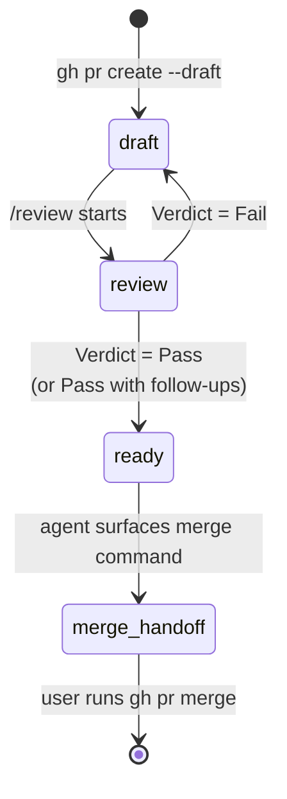

A PR in soloscrum moves through four named phases, and the boundary between "the agent runs this autonomously" and "the user has to confirm" is the central question this design answers. The contract is short:

- **Reversible transitions are autonomous.** The agent runs them, then reports.
- **Irreversible transitions are user-gated.** The agent surfaces the exact command and stops.
- **The verdict is the decision point.** Once `/review` reaches Pass, the rest of the post-verdict actions run end-to-end without further prompts — the agent does not pause to second-guess each reversible step.

That contract exists because the failure mode that motivated this design is over-cautious agents that ask "may I run `gh pr ready`?" after a Pass verdict. The verdict already decided, the action is reversible, and pausing for permission is exactly what soloscrum is built to avoid.

## Phases



A PR is created directly in **draft** by `/develop`. It is never created as ready and demoted; agents do not demote a ready PR back to draft on their own.

| Phase | GitHub state | Owner | Purpose | Exit |
|---|---|---|---|---|
| `draft` | open, draft | dev | Implementation lands; the local quality gate runs | `/review` is launched |
| `review` | open, draft | review | DoD + AC + CodeRabbit + multi-agent + per-finding decisions | Verdict reached |
| `ready` | open, ready | review | Verdict was Pass; tracker subtask is `done`; CI is green | `gh pr ready` lands |
| `merge-handoff` | open, ready | **user** | The user's final gate — agent never runs `gh pr merge` | User runs `gh pr merge` |

## Why a draft window exists

The draft phase isn't decoration. Two independent reasons keep it in place, and either alone justifies the cost:

1. **Auto-reviewer suppression.** GitHub-side reviewers (CodeRabbit, your org's bot, etc.) typically do not run on draft PRs. Holding the PR in draft until the local pipeline has decided every finding avoids redundant or conflicting reviews and avoids burning paid review credits on a PR the local pipeline was about to require changes to anyway.
2. **A self-quality gate.** Even when no GitHub-side reviewer exists, the draft phase is the explicit window for the local CodeRabbit CLI plus multi-agent pipeline to run before the PR is "presented as ready." This gives the verdict semantics in [`soloscrum-define-code-review-process`](https://github.com/mew-ton/soloscrum/blob/main/skills/soloscrum-define-code-review-process/SKILL.md) a concrete state to attach to.

A repo can override the always-draft default by writing rules to `.claude/rules/pr.md`, but until that file exists, every `/develop` opens a draft PR.

## Reversible transitions — the agent runs them

A transition is reversible when undoing it is one further command and leaves no externally visible side effect that cannot be retracted in the same session. Every transition in this list runs without asking:

| Transition | Command | How to undo |
|---|---|---|
| Create draft PR | `gh pr create --draft` | `gh pr close` |
| Promote to ready | `gh pr ready` | `gh pr ready --undo` |
| Approve review | `gh pr review --approve` | dismiss the review |
| Comment on PR | `gh pr comment` | delete the comment |
| Add / remove labels | `gh issue edit --add-label / --remove-label` | reverse the edit |
| Tracker state transition | (delegated to a tracker operation skill) | call again with previous state |

If you find yourself debating "should I run `gh pr ready` now or check first?" the answer is run it. The verdict already decided.

## Irreversible transitions — the user's gate

A transition is irreversible when undoing it is impossible, requires admin intervention, or fires externally visible side effects (notifications, downstream automation, cost) that cannot be cleanly retracted. The agent surfaces the command and stops:

| Transition | Why irreversible |
|---|---|
| `gh pr merge` | Commits land on the base branch; downstream CI / deploys / notifications fire |
| `git push --force` to a shared branch | Overwrites others' history |
| `gh pr close --delete-branch` (with no other backup) | Branch is gone |
| Anything that triggers paid external automation | Cost is incurred |

`gh pr merge` is **always** user-gated, regardless of how clean the verdict was, how recently the user authorised something else, or how trivially small the diff looks.

## Self-approve refusal in solo-dev

GitHub does not let a PR's author approve their own PR. In a solo-dev setup — the design point soloscrum's `/review` is built around — `gh pr review --approve` will fail with:

```text
failed to create review: GraphQL: Review Can not approve your own pull request
```

This is **not** a Fail. The verdict comment posted on the PR is the formal Pass record; the API-side approval is a duplicate signal that solo-dev structurally cannot produce. The implementation is a try-and-fall-through:

```bash
gh pr review --approve "$PR_URL" \
  || echo "approve skipped (likely self-approve refusal); verdict comment is the formal Pass record"
```

The post-verdict sequence — tracker `→ done`, CI wait, `gh pr ready`, surfacing the merge command — runs anyway.

## Issue close happens at merge

One subtle point: `/review` reaching Pass does **not** close the Issue. It only flips the subtask state to `done`. The Issue closes when the PR merges, via the `Closes #N` keyword GitHub honours — and the DoD requires that keyword in every PR body.

Why merge-time and not verdict-time? Because "closed" in GitHub conventionally means "the change shipped into the base branch." Closing at verdict, before merge, would break that convention: a Pass followed by the user deciding not to merge would leave the Issue closed without the work landing. The user's merge gate is also the closure gate.

For parent Issues whose closing PR referenced sub-issues instead of the parent itself, the `/refine` janitor sweep at the start of the next refine command picks up the slack and closes them.

## Verdict to next-action map

| Verdict | Sequence | User pre-confirm? |
|---|---|---|
| **Pass** | `gh pr review --approve` → subtask `→ done` → wait for CI green → `gh pr ready` → surface merge command | No (all reversible) |
| **Pass with follow-ups** | confirm follow-up Issues exist for each out-of-scope skip → same as Pass | No |
| **Fail** | post per-finding feedback → subtask `→ in-progress` → leave PR in draft | No (all reversible) |
| (any verdict) → merge | user runs `gh pr merge` | **Yes (user gate)** |

If CI goes red during the wait step, the Pass retroactively downgrades to Fail: the agent posts the failed conclusions, reverts the subtask to `in-progress`, and skips the remaining Pass actions. CI green is part of the Pass contract.

## See also

- The full autonomy table, anti-patterns, and verdict-to-action mapping live in [`skills/soloscrum-define-pr-lifecycle/SKILL.md`](https://github.com/mew-ton/soloscrum/blob/main/skills/soloscrum-define-pr-lifecycle/SKILL.md).
- For how findings are decided before the verdict is set, see the [code review process concept](/concept/code-review-process/).
