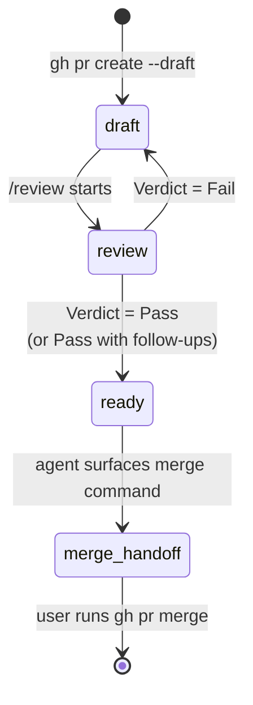

PR は 4 つのフェーズを順に通過します。soloscrum では、agent が自律的に実行する遷移と、ユーザの確認が必要な遷移を明確に分けています。

- **reversible な遷移は agent が自律実行します。** 実行後に結果を報告します。
- **irreversible な遷移はユーザのゲートです。** agent は正確なコマンドを提示して停止します。
- **verdict が決定ポイントです。** `/review` が Pass に達した時点で、後続のアクションは最後まで一気に走ります。reversible な 1 ステップごとに確認を取り直すことはしません。

Pass の verdict が出た後に「`gh pr ready` を実行してよいですか」と聞くような挙動は、この契約に反します。

## フェーズ



`/develop` は PR を最初から **draft** として作成します。soloscrum は PR を ready で作成してから draft に降格させることはしませんし、agent が ready 状態の PR を勝手に draft に戻すこともありません。

| フェーズ | GitHub 上の状態 | Owner | 目的 | 出口 |
|---|---|---|---|---|
| `draft` | open + draft | dev | 実装を入れ、local の quality gate を走らせる | `/review` が起動される |
| `review` | open + draft | review | DoD + AC + CodeRabbit + multi-agent + 各 finding の判断 | verdict が確定する |
| `ready` | open + ready | review | verdict は Pass、subtask は `done`、CI は green | merge コマンドが提示される |
| `merge-handoff` | open + ready | **user** | ユーザの最終ゲート (agent は `gh pr merge` を実行しない) | ユーザが `gh pr merge` を実行 |

## draft フェーズが存在する理由

draft フェーズには独立した 2 つの役割があります。

1. **GitHub 側 reviewer を抑止します。** CodeRabbit や組織 bot などの GitHub 側 reviewer は通常、draft PR には動きません。local の pipeline がすべての finding を処理し終わるまで draft に保つことで、無駄な review や重複コメントを避けられ、また有料 review のクレジットを「local 側で修正が必要な PR」に消費せずに済みます。
2. **local の quality gate のための窓を確保します。** GitHub 側に reviewer がいないリポジトリでも、draft フェーズは local の CodeRabbit CLI と multi-agent pipeline を実行する明示的なタイミングとして機能します。[`soloscrum-define-code-review-process`](https://github.com/mew-ton/soloscrum/blob/main/skills/soloscrum-define-code-review-process/SKILL.md) の verdict semantics はこの状態に紐づきます。

リポジトリ側で `.claude/rules/pr.md` を置くことで、「常に draft で作成する」というデフォルトを上書きできます。このファイルが存在しないリポジトリでは、`/develop` は常に draft で PR を開きます。

## reversible な遷移 — agent が実行する

reversible とは、追加コマンドを 1 つ実行するだけで取り消せる操作を指します。同一セッション内で撤回できない外部効果を残しません。次の遷移はいずれもユーザに確認を取らずに実行します。

| 遷移 | コマンド | 取り消し方 |
|---|---|---|
| draft PR を作成 | `gh pr create --draft` | `gh pr close` |
| ready に昇格 | `gh pr ready` | `gh pr ready --undo` |
| review を approve | `gh pr review --approve` | review を dismiss |
| PR にコメント | `gh pr comment` | コメントを削除 |
| ラベルの付与・削除 | `gh issue edit --add-label / --remove-label` | 逆の編集を行う |
| tracker の state 遷移 | (tracker operation skill に委譲) | 直前の state を引数に再度呼び出す |

verdict が Pass になった後の `gh pr ready` は、何の確認も挟まずそのまま実行します。verdict そのものが決定ポイントだからです。

## irreversible な遷移 — ユーザのゲート

irreversible とは、取り消しが不可能、または admin 権限が必要な操作、もしくは通知・自動化・コストなど外部へのアクションが発生する遷移を指します。agent はコマンドを提示して停止します。

| 遷移 | irreversible な理由 |
|---|---|
| `gh pr merge` | base ブランチに commit が乗り、CI / deploy / 通知などが連鎖的に発火する |
| 共有ブランチへの `git push --force` | 他者の history を上書きする |
| `gh pr close --delete-branch` (他にバックアップがない場合) | ブランチが失われる |
| 有料の外部自動化を発火させる操作 | コストが発生する |

`gh pr merge` は **常に** ユーザのゲートです。verdict が綺麗だった、直前に同じ意図の承認があった、diff が小さい、といった事情があっても例外はありません。

## solo-dev での self-approve 拒否

GitHub は PR の作成者本人による approve を許可していません。solo-dev では `gh pr review --approve` が次のように失敗します。

```text
failed to create review: GraphQL: Review Can not approve your own pull request
```

これは Fail ではありません。verdict コメントこそが Pass の正式な記録であり、API 側の approve は solo-dev では構造上発生し得ない重複シグナルです。try-and-fall-through のパターンで処理します。

```bash
gh pr review --approve "$PR_URL" \
  || echo "approve skipped (likely self-approve refusal); verdict comment is the formal Pass record"
```

verdict 後の一連のアクション — tracker の `→ done`、CI 待機、`gh pr ready`、merge コマンドの提示 — はそのまま続行します。

## Issue close は merge のタイミング

`/review` が Pass に到達しても、Issue は close されません。subtask の state が `done` に切り替わるだけです。Issue を実際に閉じるのは PR の merge であり、その引き金は PR 本文の `Closes #N` キーワードです。DoD はすべての PR 本文にこのキーワードを含めることを要求しています。

merge 時に閉じる挙動は GitHub の慣習に揃えています。「closed」は「base ブランチに取り込まれた」を意味します。verdict 時点で閉じてしまうと、Pass が出た後にユーザが merge しないと判断した場合に、コードが入っていないのに Issue が閉じている、というずれが生じます。merge ゲートが close ゲートを兼ねる形にしています。

closing PR が sub-issue 側を参照していて GitHub の自動 close が効かなかった親 Issue については、次回の `/refine` で janitor sweep が回収します。

## verdict と次のアクションの対応

| Verdict | 実行する手順 | ユーザ確認 |
|---|---|---|
| **Pass** | `gh pr review --approve` → subtask `→ done` → CI green を待つ → `gh pr ready` → merge コマンドを提示 | 不要 (すべて reversible) |
| **Pass with follow-ups** | スコープ外として skip した finding に対する follow-up Issue があることを確認 → 以降は Pass と同じ | 不要 |
| **Fail** | finding ごとのフィードバックを投稿 → subtask `→ in-progress` → PR は draft のまま | 不要 (すべて reversible) |
| (verdict の種類によらず) → merge | ユーザが `gh pr merge` を実行 | **必要 (ユーザゲート)** |

CI 待機の間に red になった場合、Pass はさかのぼって Fail に格下げされます。agent は失敗した check の結果を投稿し、subtask を `in-progress` に戻し、残りの Pass アクションを実行せずに止まります。CI が green であることは Pass の契約の一部です。

## 参考

- 完全な autonomy テーブル、anti-pattern、verdict ごとの行動表: [`skills/soloscrum-define-pr-lifecycle/SKILL.md`](https://github.com/mew-ton/soloscrum/blob/main/skills/soloscrum-define-pr-lifecycle/SKILL.md)
- verdict を出すまでの finding の扱い: [code review process](/ja/concept/code-review-process/)
