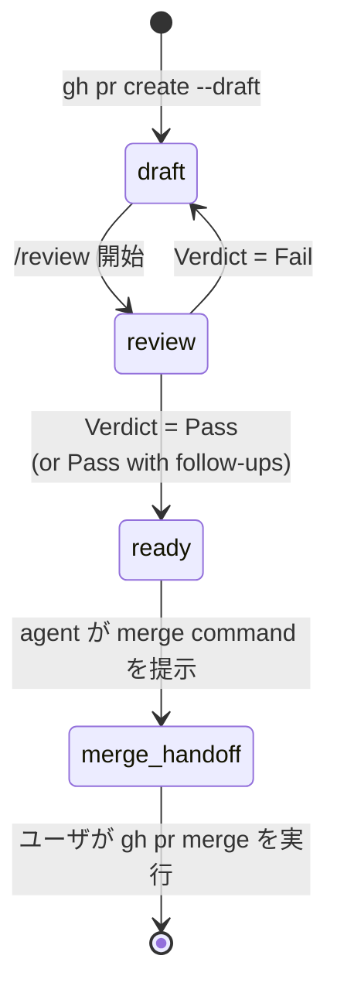

soloscrum における PR は、名前のついた 4 つのフェーズを順に辿る。「agent が自律的に実行する」と「ユーザの確認が要る」の境界をどこで切るか — それがこの設計が答える中心的な問いだ。契約はシンプルに 3 行で書ける:

- **reversible な遷移は自律的に実行する。** agent が実行し、結果を報告する。
- **irreversible な遷移はユーザゲート。** agent は正確な command を提示して停止する。
- **verdict が決定点。** `/review` が Pass に到達したら、verdict 後のアクションは確認を挟まずに end-to-end で走り抜ける。reversible な各ステップで agent が立ち止まることはない。

この契約が必要になった理由は、まさに失敗モードがそこにあるからだ — Pass verdict の後に「`gh pr ready` を実行してもよいですか?」と尋ねてくる過剰に慎重な agent。verdict はもう決まっていて、アクションは reversible で、確認を求めて止まること — それ自体が soloscrum が避けたい挙動だ。

## フェーズ



PR は `/develop` が直接 **draft** で作成する。ready で作ってから draft に戻す経路は存在せず、agent が ready PR を独自判断で draft に戻すこともない。

| フェーズ | GitHub state | Owner | 目的 | Exit |
|---|---|---|---|---|
| `draft` | open, draft | dev | 実装の着地、ローカル品質ゲートの実行 | `/review` 起動 |
| `review` | open, draft | review | DoD + AC + CodeRabbit + multi-agent + finding ごとの決定 | verdict 到達 |
| `ready` | open, ready | review | verdict が Pass、tracker subtask は `done`、CI green | merge command 提示 |
| `merge-handoff` | open, ready | **ユーザ** | ユーザの最終ゲート。agent が `gh pr merge` を実行することはない | ユーザが `gh pr merge` を実行 |

## なぜ draft window が存在するのか

draft フェーズは飾りではない。独立した 2 つの理由が支えており、どちらか片方だけでもコストを正当化する:

1. **auto-reviewer の抑止。** CodeRabbit や組織の bot など、GitHub 側の reviewer は通常 draft PR では動かない。ローカル pipeline が各 finding を決定し終わるまで draft のままにしておけば、冗長または衝突する review が発生せず、ローカル pipeline がどうせ修正を要求する PR に有料 review クレジットを使わずに済む。
2. **self-quality ゲート。** GitHub 側の reviewer が存在しない場合でも、draft フェーズは「ready として提示する」前にローカル CodeRabbit CLI + multi-agent pipeline を走らせる明示的な window として機能する。これにより [`soloscrum-define-code-review-process`](https://github.com/mew-ton/soloscrum/blob/main/skills/soloscrum-define-code-review-process/SKILL.md) の verdict セマンティクスが、具体的な state に紐付く。

`.claude/rules/pr.md` にルールを書けば always-draft デフォルトを override できるが、そのファイルがないかぎりすべての `/develop` は draft PR を開く。

## reversible な遷移 — agent が実行

reversible な遷移とは、1 つの追加 command だけで取り消せて、同セッション内に取り消せない外部副作用を残さないものを指す。次の表の遷移はすべて、確認なしで実行される:

| 遷移 | command | 取り消し方 |
|---|---|---|
| draft PR を作成 | `gh pr create --draft` | `gh pr close` |
| ready に昇格 | `gh pr ready` | `gh pr ready --undo` |
| review を承認 | `gh pr review --approve` | review を dismiss |
| PR にコメント | `gh pr comment` | コメントを削除 |
| ラベル追加 / 削除 | `gh issue edit --add-label / --remove-label` | 同じ edit を逆方向に |
| tracker state 遷移 | (tracker operation skill に委譲) | 前 state を指定して再実行 |

「`gh pr ready` を今実行すべきか、念のため確認すべきか」と迷ったら実行する — それが答えだ。verdict はもう決まっている。

## irreversible な遷移 — ユーザのゲート

逆に irreversible なのは、取り消しが不可能、あるいは admin の介入が必要、または外部から見える副作用 (通知、下流の自動化、コスト) を取り消せない形で発火する遷移だ。agent は command を提示してそこで止まる:

| 遷移 | なぜ irreversible か |
|---|---|
| `gh pr merge` | commit が base branch に着地し、下流の CI / deploy / 通知が発火する |
| 共有 branch への `git push --force` | 他者の history を上書きしてしまう |
| `gh pr close --delete-branch` (他にバックアップがない場合) | branch が失われる |
| 有料の外部自動化を発火させる操作 | コストが発生する |

`gh pr merge` は **常に** ユーザゲートだ。verdict がどれほどクリーンでも、ユーザが直前に何かを承認していても、diff がいかに小さく見えても、扱いは変わらない。

## solo-dev での self-approve refusal

GitHub は PR の作者が自分の PR を承認することを許さない。soloscrum の `/review` はそもそも solo-dev を中心に設計されているので、`gh pr review --approve` は次のように失敗する:

```text
failed to create review: GraphQL: Review Can not approve your own pull request
```

これは Fail では **ない**。PR に投稿された verdict コメントが正式な Pass の記録であり、API 側の承認は solo-dev では構造的に作れない重複シグナルにすぎない。実装は try-and-fall-through でよい:

```bash
gh pr review --approve "$PR_URL" \
  || echo "approve skipped (likely self-approve refusal); verdict comment is the formal Pass record"
```

verdict 後のシーケンス — tracker `→ done`、CI 待機、`gh pr ready`、merge command の提示 — はそのまま走り抜ける。

## Issue クローズは merge 時に起きる

少し細かい点だが、`/review` が Pass に到達しても Issue はクローズされ **ない**。フリップするのは subtask の state が `done` になるところだけだ。Issue 自体は、PR が merge されたときに本文の `Closes #N` キーワードを GitHub が拾って閉じる — そして DoD はそのキーワードを全 PR 本文に要求している。

なぜ verdict 時ではなく merge 時なのか。GitHub での「closed」は慣例的に「変更が base branch に着地した」を意味するからだ。verdict 時にクローズしてしまうと、Pass が出た後にユーザが merge しないと決めたケースで、作業が着地していないのに Issue だけが閉じた状態になり、慣例から外れる。ユーザの merge ゲートが、同時にクローズのゲートでもある。

なお、クロージング PR が親ではなく sub-issue を参照していた親 Issue については、次回の `/refine` 冒頭の janitor sweep が拾って閉じる。

## verdict から次アクションへのマップ

| Verdict | シーケンス | ユーザの事前確認 |
|---|---|---|
| **Pass** | `gh pr review --approve` → subtask `→ done` → CI green を待つ → `gh pr ready` → merge command を提示 | 不要 (すべて reversible) |
| **Pass with follow-ups** | 各 out-of-scope skip に follow-up Issue があるか確認 → Pass と同じ | 不要 |
| **Fail** | finding ごとのフィードバックを投稿 → subtask `→ in-progress` → PR は draft のまま | 不要 (すべて reversible) |
| (任意の verdict) → merge | ユーザが `gh pr merge` を実行 | **必要 (ユーザゲート)** |

待機ステップ中に CI が red になった場合、Pass は遡及的に Fail に降格する: agent は失敗した conclusion を投稿し、subtask を `in-progress` に戻し、残りの Pass アクションをスキップする。CI green は Pass 契約に含まれている。

## 関連項目

- autonomy 表の全文、anti-pattern、verdict-to-action マッピングは [`skills/soloscrum-define-pr-lifecycle/SKILL.md`](https://github.com/mew-ton/soloscrum/blob/main/skills/soloscrum-define-pr-lifecycle/SKILL.md) を参照。
- verdict が確定する前に finding をどう決定するかは、[code review process 概念](/ja/concept/code-review-process/) を参照。
