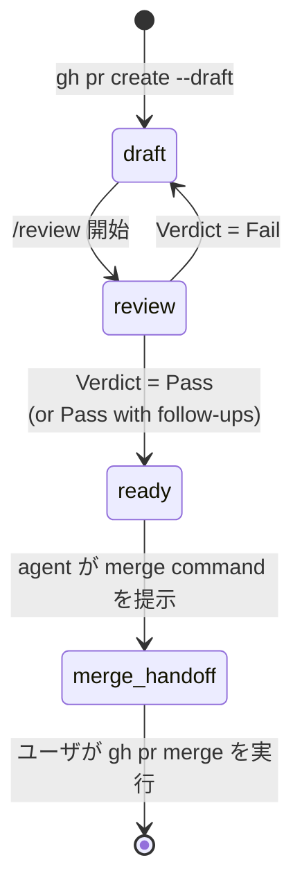

soloscrum における PR は、名前のついた 4 つのフェーズを経由します。「agent が自律的に実行する」と「ユーザが確認しなければならない」の境界が、この設計が答える中心的な問いです。契約は短いです:

- **reversible な遷移は自律的。** agent が実行し、報告します。
- **irreversible な遷移はユーザゲート。** agent は正確な command を提示して停止します。
- **verdict が決定点。** `/review` が Pass に到達したら、verdict 後のアクション群はそれ以上のプロンプトなしに end-to-end で実行されます — agent は reversible な各ステップごとに second-guess して止まりません。

この契約が存在する理由は、この設計の動機となった failure mode が、Pass verdict の後に「`gh pr ready` を実行してもよいですか?」と尋ねる過剰に慎重な agent だからです。verdict はすでに決まっており、アクションは reversible で、許可を求めて停止することは soloscrum がまさに避けるために作られたものです。

## フェーズ



PR は `/develop` によって直接 **draft** で作成されます。ready として作成されてから降格されることはありません; agent は ready PR を独自の判断で draft に戻すことはしません。

| フェーズ | GitHub state | Owner | 目的 | Exit |
|---|---|---|---|---|
| `draft` | open, draft | dev | 実装が着地; ローカル品質ゲートが動作 | `/review` が起動 |
| `review` | open, draft | review | DoD + AC + CodeRabbit + multi-agent + finding ごとの決定 | verdict 到達 |
| `ready` | open, ready | review | verdict が Pass; tracker subtask は `done`; CI は green | merge command が提示される |
| `merge-handoff` | open, ready | **ユーザ** | ユーザの最終ゲート — agent は決して `gh pr merge` を実行しない | ユーザが `gh pr merge` を実行 |

## なぜ draft window が存在するのか

draft フェーズは飾りではありません。2 つの独立した理由が存在し続けさせており、どちらか一方だけでもコストを正当化します:

1. **auto-reviewer の抑制。** GitHub 側の reviewer (CodeRabbit、組織の bot など) は通常 draft PR では動作しません。ローカル pipeline が各 finding を決定するまで PR を draft に保つことで、冗長または衝突する review を回避し、ローカル pipeline がどうせ修正を要求する PR に有料 review クレジットを焼くことを回避します。
2. **self-quality ゲート。** GitHub 側の reviewer が存在しない場合でも、draft フェーズは PR が「ready として提示される」前にローカル CodeRabbit CLI および multi-agent pipeline が走るための明示的な window です。これにより [`soloscrum-define-code-review-process`](https://github.com/mew-ton/soloscrum/blob/main/skills/soloscrum-define-code-review-process/SKILL.md) の verdict セマンティクスが具体的な state にひもづきます。

リポジトリは `.claude/rules/pr.md` にルールを書くことで always-draft デフォルトを override できますが、そのファイルが存在するまでは、すべての `/develop` は draft PR を開きます。

## reversible な遷移 — agent が実行

ある遷移は、それを取り消すのに 1 つの追加 command で済み、同じセッション内で取り消せない外部から見える副作用を残さないとき、reversible です。このリストのすべての遷移は確認なしに実行されます:

| 遷移 | command | 取り消し方 |
|---|---|---|
| draft PR を作成 | `gh pr create --draft` | `gh pr close` |
| ready に昇格 | `gh pr ready` | `gh pr ready --undo` |
| review を承認 | `gh pr review --approve` | review を dismiss |
| PR にコメント | `gh pr comment` | コメントを削除 |
| ラベル追加 / 削除 | `gh issue edit --add-label / --remove-label` | edit を逆操作 |
| tracker state 遷移 | (tracker operation skill に委譲) | 前 state で再度呼ぶ |

「`gh pr ready` を今実行すべきか先に確認すべきか?」と議論しているなら、答えは実行する、です。verdict はすでに決まっています。

## irreversible な遷移 — ユーザのゲート

ある遷移は、取り消しが不可能、admin の介入を要する、または外部から見える副作用 (notification、下流自動化、コスト) をきれいに取り消せない形で発火するとき、irreversible です。agent は command を提示して停止します:

| 遷移 | なぜ irreversible か |
|---|---|
| `gh pr merge` | commit が base branch に着地; 下流の CI / deploy / notification が発火 |
| 共有 branch への `git push --force` | 他者の history を上書き |
| `gh pr close --delete-branch` (他のバックアップなし) | branch が消える |
| 有料の外部自動化を発火させるもの | コストが発生 |

`gh pr merge` は **常に** ユーザゲートです — verdict がどれほどクリーンだったか、ユーザが直前に何を承認したか、diff がどれほど小さく見えるかに関わらず。

## solo-dev での self-approve refusal

GitHub は PR の作者が自分の PR を承認することを許可しません。solo-dev のセットアップ — soloscrum の `/review` が中心に据える設計点 — では、`gh pr review --approve` は次のように失敗します:

```text
failed to create review: GraphQL: Review Can not approve your own pull request
```

これは Fail では **ありません**。PR に投稿された verdict コメントが正式な Pass の記録であり、API 側の承認は solo-dev が構造的に生成できない重複シグナルです。実装は try-and-fall-through です:

```bash
gh pr review --approve "$PR_URL" \
  || echo "approve skipped (likely self-approve refusal); verdict comment is the formal Pass record"
```

verdict 後のシーケンス — tracker `→ done`、CI 待機、`gh pr ready`、merge command の提示 — はそのまま実行されます。

## Issue クローズは merge 時に発生する

微妙なポイント: `/review` が Pass に到達しても Issue は **クローズされません**。subtask の state が `done` にフリップするだけです。Issue は PR が merge されたときに、GitHub が認識する `Closes #N` キーワード経由でクローズされます — そして DoD はすべての PR 本文にそのキーワードを要求します。

なぜ verdict 時ではなく merge 時なのか? GitHub における「closed」は慣例的に「変更が base branch に着地した」を意味するからです。verdict 時 (merge 前) にクローズすると、その慣例が崩れます: Pass に続いてユーザが merge しないと決めた場合、作業が着地していないのに Issue がクローズされた状態になります。ユーザの merge ゲートはクロージャゲートでもあるのです。

クロージング PR が親ではなく sub-issue を参照した親 Issue については、次の refine command 開始時の `/refine` janitor sweep が拾い上げてクローズします。

## verdict から次アクションへのマップ

| Verdict | シーケンス | ユーザの事前確認? |
|---|---|---|
| **Pass** | `gh pr review --approve` → subtask `→ done` → CI green を待つ → `gh pr ready` → merge command を提示 | 不要 (すべて reversible) |
| **Pass with follow-ups** | 各 out-of-scope skip に follow-up Issue があることを確認 → Pass と同じ | 不要 |
| **Fail** | finding ごとのフィードバックを投稿 → subtask `→ in-progress` → PR を draft のまま | 不要 (すべて reversible) |
| (任意の verdict) → merge | ユーザが `gh pr merge` を実行 | **要 (ユーザゲート)** |

待機ステップ中に CI が red になると、Pass は遡及的に Fail に降格されます: agent が失敗した conclusion を投稿し、subtask を `in-progress` に戻し、残りの Pass アクションをスキップします。CI green は Pass 契約の一部です。

## 関連項目

- 完全な autonomy 表、anti-pattern、verdict-to-action マッピングは [`skills/soloscrum-define-pr-lifecycle/SKILL.md`](https://github.com/mew-ton/soloscrum/blob/main/skills/soloscrum-define-pr-lifecycle/SKILL.md) にあります。
- verdict が設定される前に finding がどう決定されるかについては、[code review process 概念](/ja/concept/code-review-process/) を参照。
